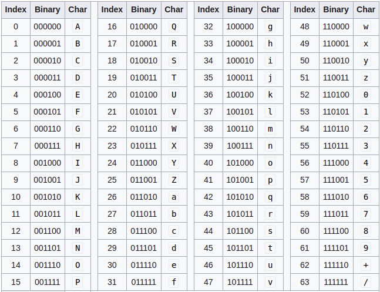

# Zamiana z ASCII na int

`chr(int)` - int na char

`ord(str) `- char na int

## hex string <-> byte string

Jak coś enkryptujemy to resulting **ciphertext** jest ciągiem bajtów (zer i jedynek). Jak chcemy to trochę zwęzić i jakoś ładniej przedstawić to możemy z bajtów zrobić hex string.

`bytes.fromhex(hexstr)` - zamienia hexstring na byte string

`.hex()` może zostać użyta na  byte string, żeby dostać hex string

## Base64

Kolejny takim jak hexstring sposobem na przedstawienie ładniej ciągu bitów jest base64. Zamienia on bajty na znaki z tablicy ASCII.

Czyli tak jak hexstring bierze 4 zera i jedynki i zamienia na jeden znak, tak base64 bierze 6 zer i jedynek i zamienia na znak ASCII.

Base64 is most commonly used online, so binary data such as images can be easily included into HTML or CSS files.

Żeby zakodować byte string w base64 trzeba użyć `base64.b64encode(byte_str)`

Żeby z base64 zdekodować na ciąg bajtów - `base64.b64decode(base64_str)`

