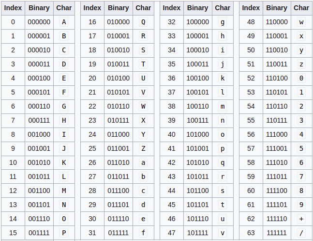
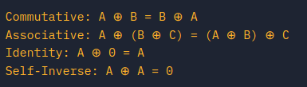

# Zamiana z ASCII na int

`chr(int)` - int na char

`ord(str) `- char na int

## hex string <-> byte string

Jak coś enkryptujemy to resulting **ciphertext** jest ciągiem bajtów (zer i jedynek). Jak chcemy to trochę zwęzić i jakoś ładniej przedstawić to możemy z bajtów zrobić hex string.	

`bytes.fromhex(hexstr)` - zamienia hexstring na byte string

`.hex()` może zostać użyta na byte string, żeby dostać hex string

## Base64

Kolejny takim jak hexstring sposobem na przedstawienie ładniej ciągu bitów jest base64. Zamienia on bajty na znaki z tablicy ASCII.

Czyli tak jak hexstring bierze 4 zera i jedynki i zamienia na jeden znak, tak base64 bierze 6 zer i jedynek i zamienia na znak ASCII.



Base64 is most commonly used online, so binary data such as images can be easily included into HTML or CSS files.

Żeby zakodować byte string w base64 trzeba użyć `base64.b64encode(byte_str)`

Żeby z base64 zdekodować na ciąg bajtów - `base64.b64decode(base64_str)`

## XOR

o xorze powiem tyle ze xoruje się bajt po bajcie

|  A   |  B   | A^B  |
| :--: | :--: | :--: |
|  0   |  0   |  0   |
|  1   |  0   |  1   |
|  0   |  1   |  1   |
|  1   |  1   |  0   |

Zauważ własność:

```
A = 0001011
B = 1010011
A^B = 1011000 = C //nazwijmy te zmienną C
// co się okazuje to to że jak zrobimy xor B ^ C
B^C = 001011 // to wychodzi A
stąd
if A^B=C ==> A^C=B and B^C=A
```

Reszta własności:



### Funkcja do XORowania byte strings

```python
def byte_xor(ba1, ba2):
    return bytes([_a ^ _b for _a, _b in zip(ba1, ba2)])

key1 = bytes.fromhex('a6c8b6733c9b22de7bc0253266a3867df55acde8635e19c73313')
key2 = byte_xor(key1,bytes.fromhex('37dcb292030faa90d07eec17e3b1c6d8daf94c35d4c9191a5e1e'))
```

