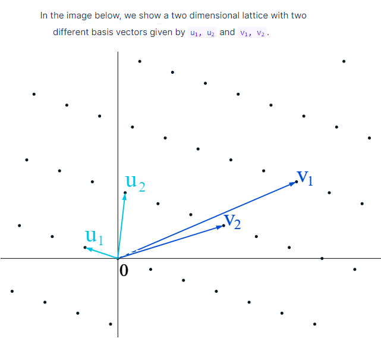
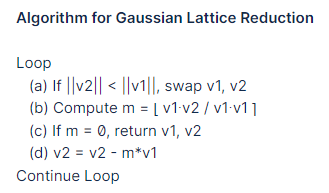

# Lattices

## Vectors

### Addition and multiplication

Vector space `V` over a field (ten mniej szczególny przypadek pierścienia) `F` to zbiór z dwoma operatorami:

- vector addition - takes two vectors and produces another verctor `v + w = z, for v,w,z ∈ V`
  - `v + w = (a,b) + (c,d) = (a+c, b+d)`
- scalar multiplication - takes a vector and a scalar and produces a vector: `a*v = w, for v,w ∈ V, a ∈ F`
  - `c*v = c*(a,b) = (c*a, c*b)`

### Inner product (dot product)

takes two vectors and returns a scalar

`v ∙ w = a for v,w ∈ V, a ∈ F`

In 2-dimensions: `v ∙ w = (a,b) ∙ (c,d) = a*c + b*d`

### Independence

Set of vectors `v1, v2, ..., vk ∈ V` is are linearly independent if the only solution to the equation

```
a1*v1 + a2*v2 + ... + ak*vk = 0
```

is for `a1 = a2 = ... = ak = 0`

### Basis

A basis is a set of linearly independent vectors `v1, v2, ..., vn ∈ V` such that any vector `w ∈ V` can be written as:

```
w = a1*v1 + a2*v2 + ... + ak*vn
```

Czyli każdy wektor bazy da się zapisać jako kombinacja innych wektorów bazy.

Liczba wektorów w bazie mówi o tym jaki dimension ma vector space

### Size

`||v||^2 = v ∙ v`

Rozmiar to dot product na samym sobie

### Orthogonal and Orthonormal 

A basis is orthogonal if for a vector basis `v1, v2, ..., vn ∈ V`, the inner product between any two different vectors is zero: `vi ∙ vj = 0, i ≠ j`.

A basis is orthonormal if it is orthogonal and `||vi|| = 1, for all i`.`

## Gramm-shmidt

Wymyślił algorytm jak dla danej bazy (zbiór niezależnych wektorów, gdzie każda to kombinacja jego kolegów) znaleźć bazę, która dodatkowo jest ortogonalna (dot product każdej pary wektorów z tej bazy jest równy 0).

## Lattice

Mając set niezależnych vectorów `v1, v2, ..., vn ∈ Rm`, to sałata `L` generowana przez ten set, to ten ale który ma INTEGER COEFFICIENTS	

```
L = {a1*v1 + a2*v2 + ... + ak*vk : a1, a2, ..., an ∈ Z}.
```

*Baza* sałaty `L` to to jakikolwiet set niezależnych wektorów, ktory generuje `L`. Baze sobie można wybierać niemalże "dowolnie".

Lattice to po angielsku kratownica i zobacz tu na rysunku niżej (widać kropki bo coefficients to są inty).



Używając bazy, możemy reach any point of the lattice with integer multiplies of jakiś wektor z bazy. Wektory z bazy also define **the fundamental domain**

```
F(v1,...,vn) = {t1 v1 + t2 v2 + ... + tn vn : 0 ≤ ti < 1}.
```

To fundamental domain to tworzy jakąś objętość. Np. dla 2 wymiarowego przypadku to jest równoległobok z bokami `u1`, `u2` (lub `v1`,`,v2`)

## Gaussian Reduction

Gauss developed his algorithm to find an optimal basis for a two-dimensional lattice given an arbitrary basis.
