# Quadratic Residue

Weźmy pierścien modulo p=29.
Da się obliczyć np. `a^2`, gdy `a = 11`. To będzie `5` (bo `11^2 = 121, 121 % 29 = 5`).
No ale weźmy np. jaki jest pierwiastek kwadratowy (square root) z  `18` w tym pierscieniu?. No to trzeba znaleźć takie `a`, żeby `a^2==18`. 
Okazuje się że nie ma.
Dla tych liczb, dla których istnieje pierwiastek w danym pierścieniu to mówimy, że one są **Quadratic Residues** tego pierścienia.
A te drugie jak np. 18 wyżej to są **Quadratic Non-Residue**.

```
We say that an integer x is a Quadratic Residue if there exists an a such that a^2 -=- x mod p. If there is no such solution, then the integer is a Quadratic Non-Residue.
```

Prościej mówiąc w danym pierścieniu `modulo p` liczba `x` jest **Quadratic Residue** jeśli jest możliwe wyciągnąć z niej pierwiastek.

# Legendre Symbol
In Quadratic Residues we learnt what it means to take the square root modulo an integer. We also saw that taking a root isn't always possible.

Taki brute force to słaba tehcnika dlatego Legendre wymyślił wzór, żeby jedną kalkulacją sprawdząć czy dany int `a` jest *quadratic residue* w danym pierścieniu.

Założenia sa takie, że w naszym `modulo p`, `p` jest prime.

Ale zanim do wzoru to mały detour żeby zapoznać się z pewną własnością dotyczącą *Quadratic Non-Residues*.
```
Quadratic Residue * Quadratic Residue = Quadratic Residue            // QR * QR = QR
Quadratic Residue * Quadratic Non-residue = Quadratic Non-residue    // QR * QNR = QNR
Quadratic Non-residue * Quadratic Non-residue = Quadratic Residue    // QNR * QNR = QR
```

Symbol Legendre'a to `(a/p)` i jest on przystający modulo z  `(a/p) -=- a^((p-1)/2) mod p`, oraz  `p ∈ {-1,0,1}`
Ma bardzo fajną zależność otóż okazuje się że:

- jeśli `a` jest quadratic-residue w pierscieniu `modulo p` oraz `a -=- 0 mod p` to `(a/p) = 1`
- jeśli `a` jest quadratic-non-residue to `(a/p) = -1`
- jeśli `a -=- 0 mod p` to `(a/p) = 0`
- ofc. są też pozostałe wartości symbolu legendre'a wtedy one nic nam nie mówią


## Zadanie
Mamy dane `p = 101524035174539890485408575671085261788758965189060164484385690801466167356667036677932998889725476582421738788500738738503134356158197247473850273565349249573867251280253564698939768700489401960767007716413932851838937641880157263936985954881657889497583485535527613578457628399173971810541670838543309159139`

Ze pierścienia `modulo p` znaleźliśmy jakieś `x`, które jest jego **Quadratic Residual**

Znaleźliśmy za pomocą symbolu Legendre'a, więc wiemy że:

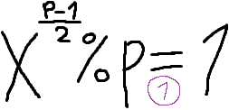

Dodatkowo z hinta wiemy, że:

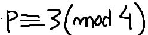

Czyli, że `p` oraz `3` dzieli całkowita wielokrotność czwórek, czyli że `p%4=3`

Szukamy teraz square root z `x`, czyli takiego `i`, że:

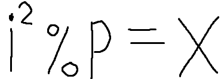

Zauważamy równolegle dwie rzeczy:

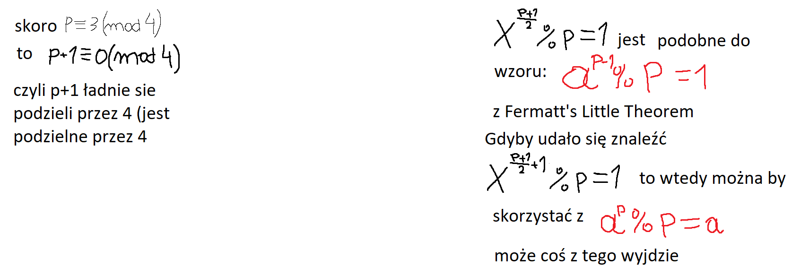

No i teraz magicznie na podstawie tych dwóch rzeczy strzelam sobie, że:

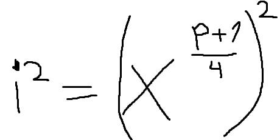

Ale uprośćmy to trochę:

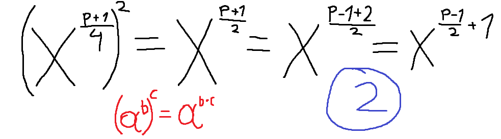

No i co się okazuję?

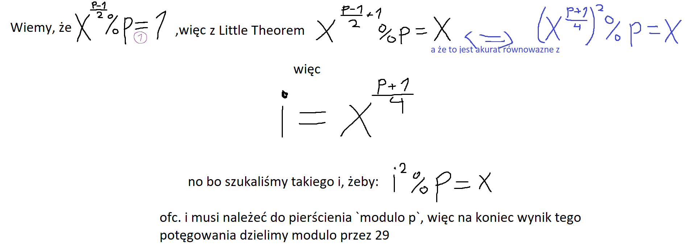

# Modular Square Root

W poprzednim zadaniu nauczyliśmy się sprawdzać, czy liczba jest Quadratic Residue jakieś pierścienia `modulo p`. Umiemy sprawdzić czy liczba ma square root (otrzymać odpowiedź tak lub nie), teraz fajnie by było umieć policzyć pierwiastek.


Każda liczba pierwsza `p`, która nie jest dwójką ma postać `p -=- 1 mod 4` lub `p -=- 3 mod 4`. 

W przypadku liczb gdzie `p -=- 3 mod 4`, formułę można łatwo wynieść z Fermat Little Theorem (tak jak w poprzednim zadaniu). Ale w przypadku drugim należy posłużyć się bardziej skomplikowanym i ogólnym algorytmem.


Taki ogólny algorytm nazywa się Tonelli-Shanks:

```
r^2 -=- a mod p =====> r^2 % a = p
```

Algorytm dla danego `a` i `p` oblicza `r`.

## Idea algorytmu

Mając `a` i prime `p` kryterium Eulera mówi nam czy `a` ma square root w pierścieniu `modulo p`

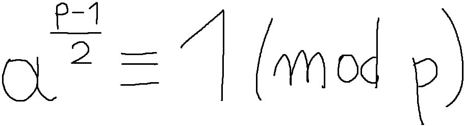

In conrast if number has no square root (is non-residue), Euler criterion tells us that:

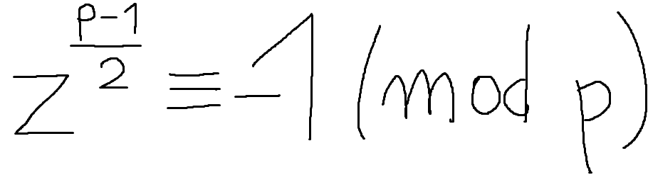

It is not hard to find such , because half of the integers between 1 and  have this property. So we assume that we have access to such a non-residue.


`p-1` możemy zapisać jako `Q*2^S` jak? Po prostu dziel `p-1` na 2 `S` razy.

## Chinese Remainder Theorem

The Chinese Remainder Theorem gives a unique solution to a set of linear congruences if their moduli are coprime.

The Chinese Remainder Theorem unikalne rozwiązanie do układu ~~równań~~ przystawań, których moduli są liczbami względnie pierwszymi

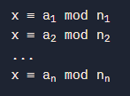

Co to liczby względnie pierwsze? Że ich `gdc(n1,n2) = 1`

No i jeśli mamy taki układ przystawań to:


Po polsku (nie po chińsku hehe):

The Chinese Remainder Theorem mówi, że jeśli ktoś zna wyniki dzielenia modulo liczby `x` przez kilka integerów (`n1, n2, n3..`), no to ten ktoś może wtedy unikalnie obliczyć resztę z dzielenie tej liczby `x` przez produkt (wynik mnożenia) tych integerów (`N=n1*n2*n3`), pod warunkiem, że integery te są względnie pierwsze.

Przykład:

Jeśli ktoś wie że liczba reszta z dzielenia `x` przez 3 jest 2 (`x % 3 = 2`), reszta z dzielenia `x` przez 5 jest 3 (`x % 5 = 3`), a przez 7 to 2 (`x % 7 = 2`), to bez znajomości liczby `x`, ten ktoś wie, że reszta z dzielenia `x` przez 105 (`3 * 5 * 7`) jest 23.

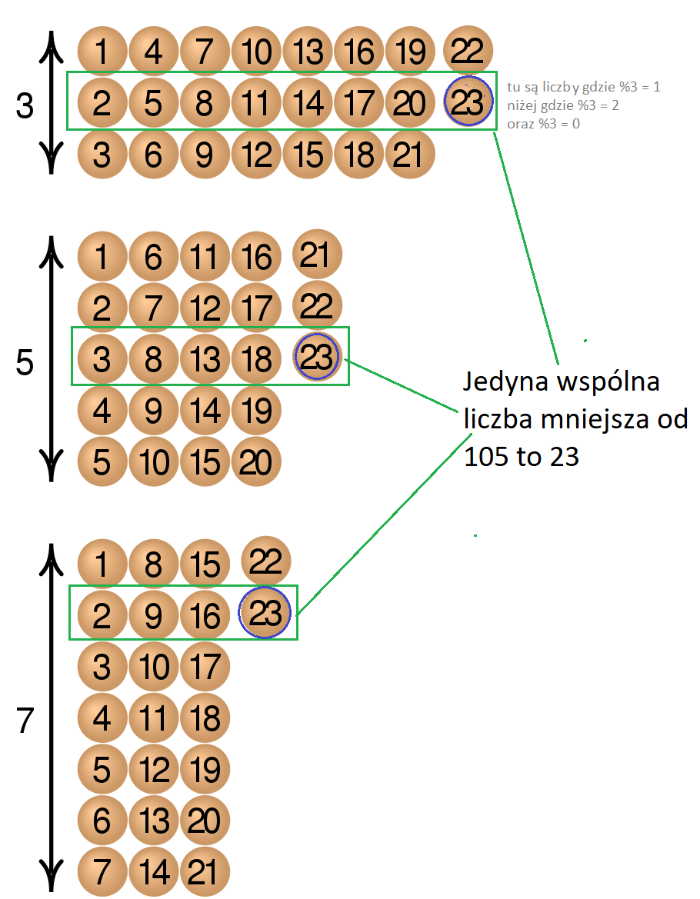
