# HOW AES WORKS

Stream ciphers - szyfrują bit po bicie XOR'ując go z kluczem

Block ciphers - szyfrują bloku po bloku (blok to może być np. 128bitów (AES-128 tak ma))

> Block ciphers only specify how to encrypt and decrypt individual blocks, and a [mode of operation](https://en.wikipedia.org/wiki/Block_cipher_mode_of_operation) must be used to apply the cipher to longer messages. This is the point where real world implementations often fail spectacularly, since developers do not understand the subtle implications of using particular modes. 

### Keyed permutation

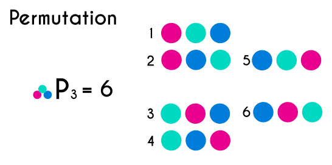

AES, like all good block ciphers, performs a "keyed permutation".  

This means that it maps every possible input block to a unique output block, with a key determining which permutation to perform.

Czyli AES dostaje blok, a klucz mu mówi jak zpermutować ten blok - to co wypluwa AES to zpermutowany blok.

Using the same key, the permutation can be performed in reverse, mapping the output block back to the original input block. It is important that there is a one-to-one correspondence between input and output blocks, otherwise we wouldn't be able to rely on the ciphertext to decrypt back to the same plaintext we started with.

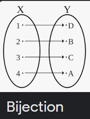

### Resisting the bruteforce

If a block cipher is secure, there should be no way for an attacker to distinguish the output of AES from a [random permutation](https://en.wikipedia.org/wiki/Pseudorandom_permutation) of bits.

Output z AES czyli spermutowany blok powinien totalnie wyglądać jak coś losowego.

Furthermore, there should be no better way to undo the permutation than simply bruteforcing every possible key.

Szyf uważamy za "akademicko złamany", jeśli istnieje technika, która ma chociaż parę steps mniej niż bruteforce.

>  How difficult is it to bruteforce a 128-bit keyspace? [Somebody estimated](https://crypto.stackexchange.com/a/48669) that if you turned the power of the entire Bitcoin mining network against an AES-128 key, it would take over a hundred times the age of the universe to crack the key.

Okazuje się, że istnieje właśnie taki atak na AES. Obniża on security level z 128bitów na 126.1bitów i nie został improved od 8 lat, więc luz. 

Ten atak się nazywa **Biclique attack**

> Finally, while quantum computers have the potential to completely break popular public-key cryptosystems like RSA via [Shor's algorithm](https://en.wikipedia.org/wiki/Shor's_algorithm), they are thought to only cut in half the security level of symmetric cryptosystems via [Grover's algorithm](https://en.wikipedia.org/wiki/Grover's_algorithm). This is one reason why people recommend using AES-256, despite it being less performant, as it would still provide a very adequate 128 bits of security in a quantum future.

### Structure of AES

To achieve a keyed permutation that is infeasible to invert without the key, AES applies a large number of ad-hoc mixing operations on the input.

Unlike the RSA which are based on individual math problems. AES is much less elegant, but it's very fast.

128bitowy blok, który chcemy zaszyfrować jest reprezentowany jako macierz bajtów o rozmiarze 4x4 - nazywamy ją `state`.  Algorytm ma 10 rund i w każdej rundzie `state` is modified by a number of invertible transformations. Jest kilka transformation steps and each has a defined purpose based on theoretical properties of secure ciphers established by Claude Shannon in the 1940s.

Algorytm:

1. **Key expansion / Key Schedule**
   1. Z 128bitowego klucza wydziel jedenaście 128-bitowych `round keys` (kluczy rundowych).  
2. **Initial key addition**
   1. *AddRoundKey* - the bytes of the first round key are XOR'd with the bytes of the state. Czyli XOR pierwszego` round key` z `state`
3. **Round** - this phase is looped 10 times, 9 main rounds and 1 final
   1. ***SubBytes*** - each byte of the state is substituted for a different byte according to a lookup table ("S-box"). 
      1. Czyli jest jakaś tablica S-box, która mówi jak podmieniać bajty - całe bajty czyli całe 8 bitów jest jakoś mapowane.
   2. ***ShiftRows*** - the last three rows of the state matrix are transported —shifted over a column or two or three.
      1. Pierwszy bajt z drugiego wiersza przenosimy na ostatnią kolumnę (ale nie zamieniamy, robimy shift)
      2. W trzecim wierszu dwa bajty
      3. W czwartym wierszu trzy bajty
   3. ***MixColumns***  - matrix multiplication is performed on the columns of the state, combining the four bytes in each column. This is skipped in the final round.
   4. ***AddRoundKey***  -  the bytes of the current round key are XOR'd with the bytes of the state.

[Ten filmik uczy fest](https://www.youtube.com/watch?v=gP4PqVGudtg)

### Round keys

Jak się dzieje **Key expansion** to sobie narazie pomijamy.

Omówimy sobie **Initial key addition**. Jak wiesz rund jest 10, a my tych round keys zrobiliśmy 11 i właśnie ten pierwszy jest wykorzystywany teraz.

Krok, który się nazywa *AddRoundKey*, czyli dodaj klucz rundy do state, po prostu robi XOR `state` i `round key`

Czyli zanim jeszcze rozpoczniemy pętle po rundkach to XOR'ujemy ten pierwszy round key z naszym state.

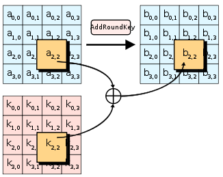

 *AddRoundKey* is what makes AES a "keyed permutation" rather than just a permutation. 

It's the <u>only</u> part of AES where the key is mixed into the state, but is crucial for determining the permutation that occurs.

> As you've seen in previous challenges, XOR is an easily invertible operation if you know the key, but tough to do if you don't. Now imagine trying to recover plaintext which has been XOR'd with 11 different keys, and heavily jumbled between each XOR operation with a series of substitution and transposition ciphers. That's kinda what AES does!

### Confusion through substitution

Omówmy **SubBytes**. This involves taking each byte of the state matrix and substituting it for a different byte in a preset 16x16 lookup table ("Substitution Box" or simply "S-Box")

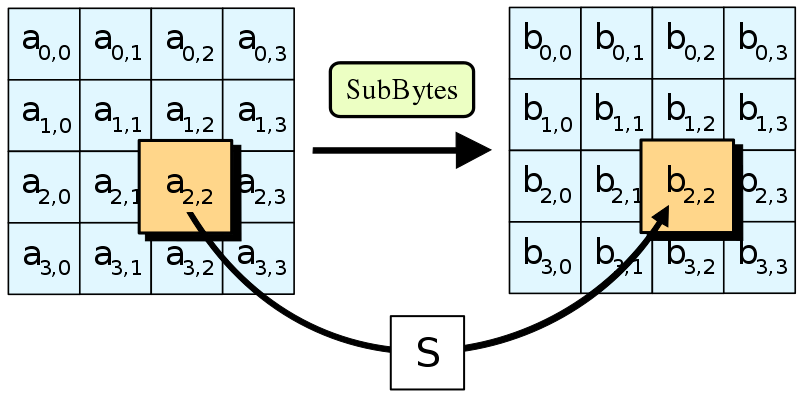

W 1945 Claude Shannon opublikował groundbreaking paper on Information Theory. Jako esential property of secure cipher wskazywał on tzw. **confusion**. "Confusion" oznacza, że relationship pomiędzy `key` a `ciphertext` powinna być tak complex jak tylko się da. Given just a ciphertext, there should be no way to learn anything about the key.

> If a cipher has poor confusion, it is possible to express a relationship between ciphertext, key, and plaintext as a linear function. For instance, in a Caesar cipher, `ciphertext = plaintext + key`. That's an obvious relation, which is easy to reverse. More complicated linear transformations can be solved using techniques like Gaussian elimination. Even low-degree polynomials, e.g. an equation like `x^4 + 51x^3 + x`, can be solved efficiently using [algebraic methods](https://math.stackexchange.com/a/1078515). However, the higher the degree of a polynomial, generally the harder it becomes to solve – it can only be approximated by a larger and larger amount of linear functions.

The main purpose of the S-box is to transform the input in a way that is resistant to being approximated by linear functions

The fast lookup in an S-box is a shortcut for performing a very nonlinear function on the input bytes. e simplest way to express the function is through the following high-degree polynomial:

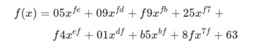

Czyli to nie jest tak, że ten S-box sobie wymyślamy: To make the S-box, the function has been calculated on all input values from 0x00 to 0xff and the outputs put in the lookup table.

### Diffusion through permutation

The other crucial property described by Shannon is "**diffusion**" -  This relates to how every part of a cipher's input should spread to every part of the output.

Substitution sama w sobie tworzy non-linearity, jednakże nie dystrybuuje jej na cały `state`. Bez diffusion, ten sam bajt na tej samej pozycji dostałby tę samą transformację za każdą rundą. To bez sensu, bo kryptoanalitycy by po prostu mogli analizować each byte position separately. 

Musimy alternować pojedyncze substytucje poprzez scramblingowanie (*ang. szamotanina*) `state'u`, ale tak, żeby substytucje zastosowane na jednym bajcie influencowały wszystkie inne bajty in the state.

<u>Each input into the next S-box then becomes a function of multiple bytes</u>, meaning that with every round the algebraic complexity of the system increases enormously.

> An ideal amount of diffusion causes a change of one bit in the plaintext to lead to a change in statistically half the bits of the ciphertext. This desirable outcome is called the [Avalanche effect](https://en.wikipedia.org/wiki/Avalanche_effect).

***

The ***ShiftRows*** and ***MixColumns*** steps combine to achieve this. They work together to ensure every byte affects every other byte in the state within just two rounds.

****

*ShiftRows* jest izi. Pierwszy row matrixa pozostaje bez zmian, drugi jest shifted over one column to the left, trzeci o dwie, czwarty o trzy. Sens tej całej akcji jest taki: "the importance of this step is to avoid the columns being encrypted independently, in which case AES degenerates into four independent block ciphers"

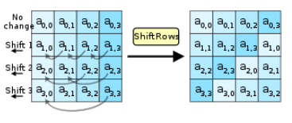

**MixColumns** już jest more complex. It performs Matrix multiplication in Rijndael's Galois field between the columns of the state matrix and a preset* matrix.

> *(of a setting on a device) adjusted or applied in advance

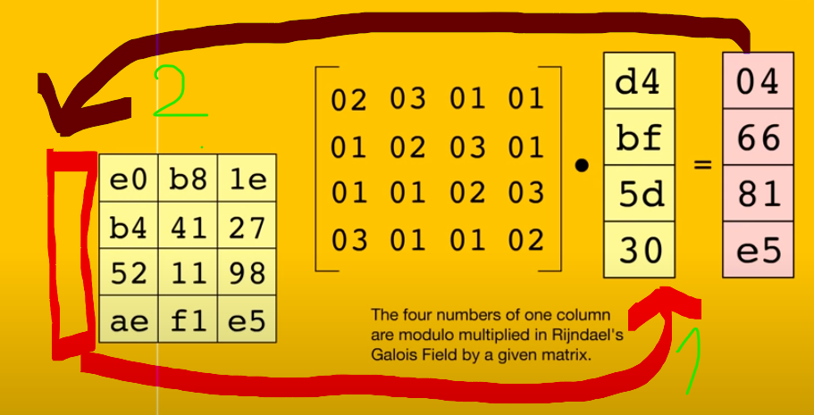

 The implementation details are nuanced; [this page](https://www.samiam.org/mix-column.html) and [Wikipedia](https://en.wikipedia.org/wiki/Rijndael_MixColumns) do a good job of covering them.

### Bring it all together

Apart from the **KeyExpansion** phase, we've sketched out all the components of AES. We've shown how *SubBytes* provides confusion and *ShiftRows* and *MixColumns* provide diffusion, and how these two properties work together to repeatedly circulate non-linear transformations over the state. Finally, *AddRoundKey* seeds the key into this substitution-permutation network, making the cipher a keyed permutation.

**Decryption** involves performing the steps described in the "Structure of AES" challenge in reverse, applying the inverse operations. Note that the KeyExpansion still needs to be run first, and the round keys will be used in reverse order. *AddRoundKey* and its inverse are identical as XOR has the self-inverse property.

# SYMMETRIC STARTER

### Modes of Operation Starter

The previous set of challenges showed how AES performs a keyed permutation on a **block** of data

In practice, we need to encrypt messages much longer than a single block. 

A ***mode of operation*** describes how to use a cipher like AES on longer messages.

All modes have serious weaknesses when used incorrectly.

#### Solution

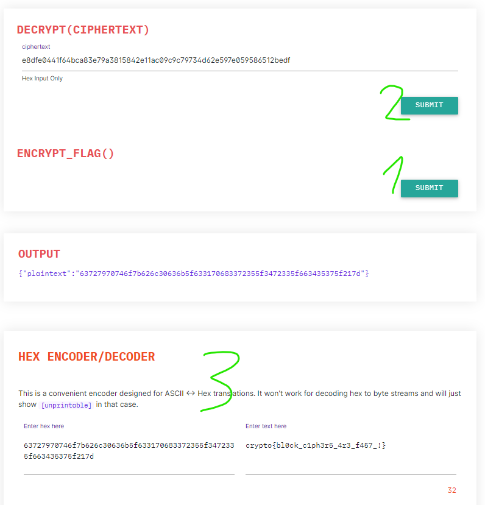

### Passwords as Keys

It is essential that keys in symmetric-key algorithms are random bytes, instead of passwords or other predictable data.

The random bytes should be generated using a **cryptographically-secure pseudorandom number generator (CSPRNG)**

## Modes

### ECB - Electronic Codebook 

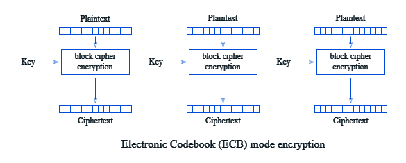

Najprostsza forma, każdy blok szyfrowany niezależnie. 

### CBC - Cipher Block Chaining 

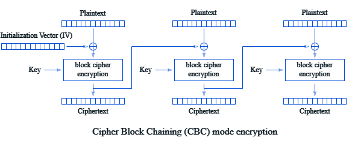

Plaintext z bloku `n` jest najpierw XOR'owany z ciphertextem bloku `n-1` i dopiero odbywa się enkrypcja.

# STREAM CIPHERS

### Symmetry

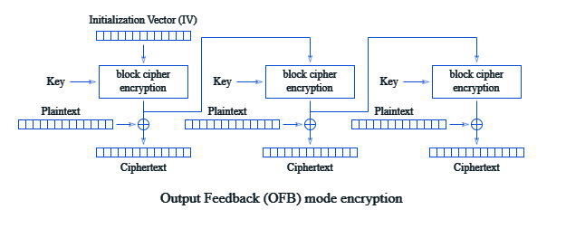
