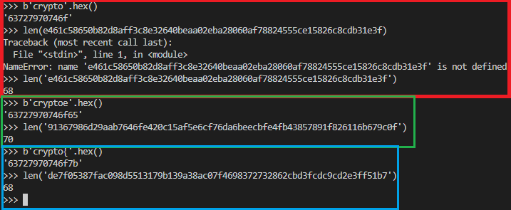

# CTRIME

Jak działa kod za endpointem?
Tu znowu mamy CTR (Counter mode decryption)
losujemy IV
robimy cipher AES w trybie CTR (wcześniej sami implementowaliśmy go, teraz uzywamy libki) counter inicjalizujemy IV
na koniec to co wyjdzie z szyfrowania to kompresujemy razem z plaintext

Clue zadania jest w kompresji poprzez **zlib**, ponieważ z racji, że eliminuje on duplicate strings, to zdradza nam jaka jest długość plaintextu. Jeśli dodanie jednego znaku do plaintextu nie zwiększy długości
ciperthext po kompresji to prawdopodobnie ten znak to szczęśliwy traf. Możemy więc w ten sposób zgadywać tak flagę literka po literce.

Robimy teraz badanie:

To że flaga zaczyna się od `crypto{` to dobra podpowiedź, zaczynam ją coraz bardziej doceniać. 
Otóż podzielmy poczynione niżej kroki na trzy tury (Red, Green, Blue).
W turze Red zamieniłem na hex `n` elementów flagi i wkleiłem jej hex pod endpoint http://aes.cryptohack.org/ctrime/, który zwrócił mi odpowiedź a ja sprawdziłem jej długość.
Teraz przechodzę do zgadywania.
W turze Green zgaadłem źle i dlugość odpowiedzi uległa zmianie.
W turze Blue zgadłem dobrze i długość odpowiedz nie uległa zmianie.

Dochodzimy do prostego wniosku że trzeba zrobić bruteforce.
