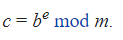
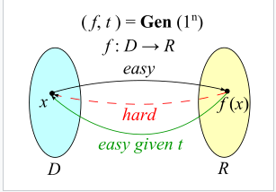
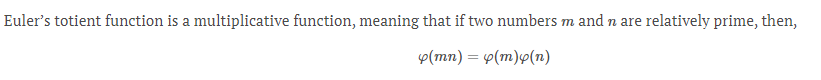
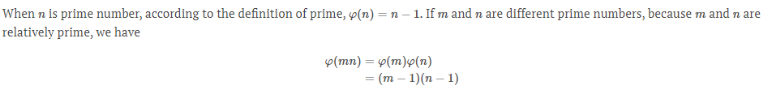
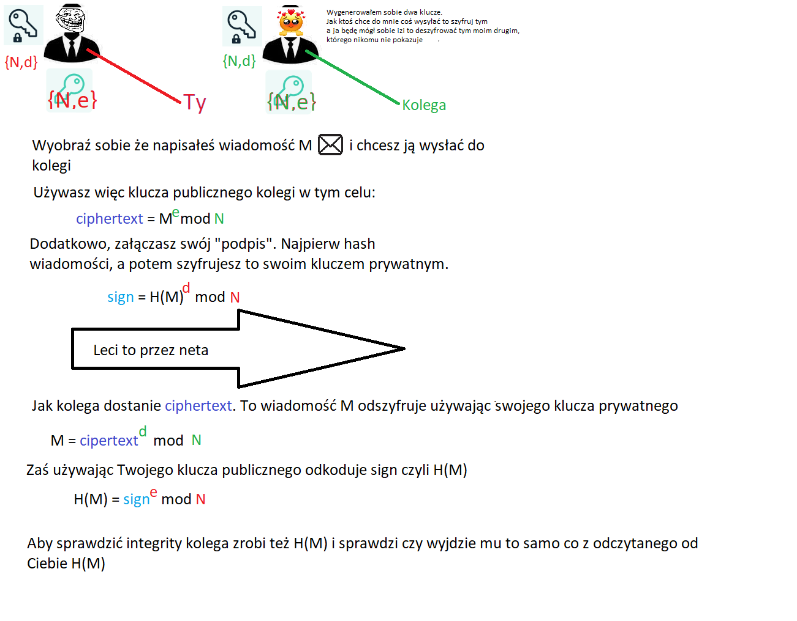

# RSA

Rok powstania 1977.

Najsłynniejszy public-key cryptosystem.

Ma dwa główne use-case'y:

- **Public Key Encryption**  - enables a user, Alice, to distribute a public key and others can use that public key to encrypt messages to her. Alice can then use her private key to decrypt the messages.
- **Digital signatures** - enable Alice to use her private key to "sign" a message. Anyone can use Alice's public key to verify that the signature was created with her corresponding private key, and that the message hasn't been tampered with.

RSA's security is based on the difficulty of factoring large composite numbers

# STARTER

## 1

### Modular exponentiation



In python

```python
pow(base, exponent, modulus)
```

In RSA, modular exponentiation, together with the problem of prime factorisation (zapisanie liczby jako iloczyn liczb pierwszych) , helps us to build a "[trapdoor function](https://en.wikipedia.org/wiki/Trapdoor_function)"

**Trapdoor function** is a [function](https://en.wikipedia.org/wiki/Function_(mathematics)) that is easy to compute in one direction, yet difficult to compute in the opposite direction (finding its [inverse](https://en.wikipedia.org/wiki/Inverse_function)) without special information, called the "trapdoor".



**Trapdoor func** lets us  to encrypt a message, and only the person with the key can perform the inverse operation to decrypt it.

## 2

Szyfrowanie RSA polega na **modular exponentation** of a message with an exponent `e` and modulus `N` (which is product of two primes (`N=p*q`))

``` 
`ciphertext` = pow(message,e,N)
```

Tgether the exponent and modulus form an RSA "**public key**" `(N, e)`. The most common value for `e` is `0x10001` or `65537`.

## 3

Bezpieczeństwo RSA polega na trudności znaleziena "factorisation of the modulus `N`". 

Jeśli uda się znaleźć `p` i `q` to możemy obliczyć  [Euler totient](https://leimao.github.io/article/RSA-Algorithm/) of `N` i łatwo odszyfrować `ciphertext`

### Eurler Torient

W Number Theory, Euler's Totient function oznaczana jako `φ(n)` zlicza wszystkie dodatnie inty aż do `n`, które są "relatively prime to `n`". Relatively rpime, czyli że gcd (greates common divisor) = 1. Np. GCD(2,4) = 2, GCD(3,4)=1

Więć Euler's totient innymi słowy zwraca:  number of integers kk in the range 1≤k≤n1≤k≤n for which the greatest common divisor gcd(n,k)gcd(n,k) is equal to 1.

> Przykład
>
> φ(6) = ?
>
> Sprawdzamy liczby k od jednego aż do 5, 
>
> counter = 0
>
> gcd(6,1) = 1 zaliczamy --> counter++
>
> gcd(6,2) = 2 nie 
>
> gcd(6,3) = 3 nie
>
> gcd(6,4) = 4 nie
>
> gcd(6,5) = 1 zaliczamy --> counter++
>
> wychodzi więc, że φ(6)=2

Jest taki wzór 



A potem taki:



## 4

The **private key** `d` is used to decrypt the ciphertext created with corresponding **public key** `(N, e)`

The private key is the secret piece of information or "trapdoor" which allows us to quickly invert the encryption function. If RSA is implemented well, if you do not have the private key the fastest way to decrypt the ciphertext is to first factorise the modulus.

**In RSA the private key is the [modular multiplicative inverse](https://en.wikipedia.org/wiki/Modular_multiplicative_inverse) of the exponent `e` modulo the totient of `N`.**

### Modular multiplicative inverse

A **modular multiplicative inverse** of an [integer](https://en.wikipedia.org/wiki/Integer) *a* is an integer *x* such that the product *ax* is [congruent](https://en.wikipedia.org/wiki/Congruence_relation#Basic_example) (przystający) to 1 with respect to the modulus *m*


To że jakaś liczba jest congruent do innej modulo `m` to znaczy że dzieli jest całkowita wielokrotność `m`.

> ```
> 7 == 1 (mod 3) //jedynke i siódemkę dzielą równo dwie trójki
> 69 == 1 (mod 17) 
> ```
>
> 

## 5

```python
N = p*q
totient = (p-1)*(q-1)
d = pow(e, -1, totient)
public_key=[N,e]
private_key = [d]

ciphertext = pow(message, e, N)
plaintext = pow(ciphertext, d, N)
```

## 6

Jak zrobić **integrity protection**?

Mechanizm signowania na to pozwala.

