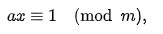

# RSA

Rok powstania 1977.

Najsłynniejszy public-key cryptosystem.

Ma dwa główne use-case'y:

- **Public Key Encryption**  - enables a user, Alice, to distribute a public key and others can use that public key to encrypt messages to her. Alice can then use her private key to decrypt the messages.
- **Digital signatures** - enable Alice to use her private key to "sign" a message. Anyone can use Alice's public key to verify that the signature was created with her corresponding private key, and that the message hasn't been tampered with.

RSA's security is based on the difficulty of factoring large composite numbers

# STARTER

## 1

### Modular exponentiation


In python

```python
pow(base, exponent, modulus)
```

In RSA, modular exponentiation, together with the problem of prime factorisation (zapisanie liczby jako iloczyn liczb pierwszych) , helps us to build a "[trapdoor function](https://en.wikipedia.org/wiki/Trapdoor_function)"

**Trapdoor function** is a [function](https://en.wikipedia.org/wiki/Function_(mathematics)) that is easy to compute in one direction, yet difficult to compute in the opposite direction (finding its [inverse](https://en.wikipedia.org/wiki/Inverse_function)) without special information, called the "trapdoor".


**Trapdoor func** lets us  to encrypt a message, and only the person with the key can perform the inverse operation to decrypt it.

## 2

Szyfrowanie RSA polega na **modular exponentation** of a message with an exponent `e` and modulus `N` (which is product of two primes (`N=p*q`))

``` 
`ciphertext` = pow(message,e,N)
```

Together the exponent and modulus form an RSA "**public key**" `(N, e)`. The most common value for `e` is `0x10001` or `65537`.

## 3

Bezpieczeństwo RSA polega na trudności znaleziena "factorisation of the modulus `N`". 

Jeśli uda się znaleźć `p` i `q` , które (`p*q=N`)to możemy obliczyć  [Euler totient](https://leimao.github.io/article/RSA-Algorithm/) of `N` i łatwo odszyfrować `ciphertext` (o tym będzie w rozdz. 5)

### Euler Totient

W Number Theory, Euler's Totient function oznaczana jako `φ(n)` zlicza wszystkie dodatnie inty aż do `n`, które są "relatively prime to `n`". Relatively rpime, czyli że gcd (greates common divisor) = 1. Np. GCD(2,4) = 2, GCD(3,4)=1

Więć Euler's totient innymi słowy zwraca:  number of integers k in the range 1≤k≤n for which the greatest common divisor gcd(n,k) is equal to 1.

> Przykład
>
> φ(6) = ?
>
> Sprawdzamy liczby k od jednego aż do 5, 
>
> counter = 0
>
> gcd(6,1) = 1 zaliczamy --> counter++
>
> gcd(6,2) = 2 nie 
>
> gcd(6,3) = 3 nie
>
> gcd(6,4) = 4 nie
>
> gcd(6,5) = 1 zaliczamy --> counter++
>
> wychodzi więc, że φ(6)=2

Jest taki wzór 


A potem taki:


## 4

The **private key** `d` is used to decrypt the ciphertext created with corresponding **public key** `(N, e)`

The private key is the secret piece of information or "trapdoor" which allows us to quickly invert the encryption function. If RSA is implemented well, if you do not have the private key the fastest way to decrypt the ciphertext is to first factorise the modulus.

**In RSA the private key is the [modular multiplicative inverse](https://en.wikipedia.org/wiki/Modular_multiplicative_inverse) of the exponent `e` modulo the totient of `N`.**

### Modular multiplicative inverse

A **modular multiplicative inverse** of an [integer](https://en.wikipedia.org/wiki/Integer) *a* is an integer *x* such that the product *ax* is [congruent](https://en.wikipedia.org/wiki/Congruence_relation#Basic_example) (przystający) to 1 with respect to the modulus *m*



To że jakaś liczba jest congruent do innej modulo `m` to znaczy że dzieli jest całkowita wielokrotność `m`.

> ```
> 7 == 1 (mod 3) //jedynke i siódemkę dzielą równo dwie trójki
> 69 == 1 (mod 17) 
> ```
>

## 5

```python
N = p*q
totient = (p-1)*(q-1)
d = pow(e, -1, totient)
public_key=[N,e]
private_key = [d]

ciphertext = pow(message, e, N)
plaintext = pow(ciphertext, d, N)
```

**Jak użyć Euler Totien to odszyfrowania message?**

Po prostu klucz prywatny `d` to wtedy `e^-1 modulus totient`

Dlatego trzeba tak robić kryptosystemy, żeby ciężko było znaleźć `p` i `q`

## 6

Jak zrobić **integrity protection**?

Mechanizm signowania na to pozwala.


# PRIMES PART 1

## Factoring

Do tej pory `N` było iloczynem (*product*) małych liczb pierwszych (*small primes*) `p` i `q`.

Ale takie małe prime'y ssą pałe, bo nowoczesnymi technikami powstające z nich `N` łatwo jest zdefaktoryzować, poznać `p` i `q` a następnie obliczyć `totient(N)` i znaleźć klucz prywatny `d`.

> These days, using primes that are at least 1024 bits long is recommended—multiplying two such 1024 primes gives you a modulus that is 2048 bits large. RSA with a 2048-bit modulus is called RSA-2048.

### Solve

W zadaniu trzeba zfactorować (znaleźć `p` i `q`) dla `N=510143758735509025530880200653196460532653147`

Dostajemy link do https://pypi.org/project/primefac/, więc tego użyje

ale najpierw trza to zainstalować

```python
pip install primefac
```

Ale to tak długo liczyyyyyyy - czekam już kilka minut.

Pomyślałem, że użyję jednak [tego linku co dali w treści](https://github.com/elliptic-shiho/primefac-fork) a nie oficjalnej libki.

Probowałem zainstalować tą komendą:

```
pip install git+git://github.com/elliptic-shiho/primefac-fork@master
```

To nawet repo się nie sklonowało xd

Zainteresował mnie ten początek readme


ostatni punkt, no to wbiłem w [link](https://github.com/ryosan-470/factordb-python)

Zainstalowałem

Spojrzałem w CLI jak uzyć i mam :D


I w tym zadaniu można tak zrobić. Reszta zadań polega na tym, aby je rozwiązać BEZ FACTORDB. Gadałem z Daniel Waszkiewicz. 

## Inferius Prime

```python
#!/usr/bin/env python3

from Crypto.Util.number import getPrime, inverse, bytes_to_long, long_to_bytes, GCD

e = 3 #exponent 3 trochę mało

# N will be 8 * (100 + 100) = 1600 bits strong which is pretty good
while True:
    p = getPrime(100) # getPrime(N) zwraca randomową N-bitówą liczbę pierwszą https://pythonhosted.org/pycrypto/Crypto.Util.number-module.html
    q = getPrime(100)
    phi = (p - 1) * (q - 1) #obliczam sobie totient, zeby niżej obliczyć d
    d = inverse(e, phi) # to jest mój klucz prywatny
    if d != -1 and GCD(e, phi) == 1: # w końcu udało mi się znaleźć moje paramsy: p,q,N,e,d
        break

N = p * q 

flag = b"XXXXXXXXXXXXXXXXXXXXXXX"
plaintext = bytes_to_long(flag)
ciphertext = pow(plaintext, e, n)

# to zapisuje do pliku
print(f"N = {N}")
print(f"e = {e}")
print(f"ciphertext = {ciphertext}")
# a tego to już nie widzicie śmiecie (Ci co rozwiązują zadanie)
plaintext = pow(ciphertext, d, n)
decrypted = long_to_bytes(pt)
assert decrypted == flag
```

```txt
n = 742449129124467073921545687640895127535705902454369756401331
e = 3
ciphertext = 39207274348578481322317340648475596807303160111338236677373
```

# PUBLIC EXPONENT

## 1 salty

```python
#!/usr/bin/env python3

from Crypto.Util.number import getPrime, inverse, bytes_to_long, long_to_bytes

e = 1
d = -1

while d == -1: # widac ktos kto pisał ten i poprzedni kod zrobił programistyczny progress upraszczając tę pętlę XDDD
    p = getPrime(512)
    q = getPrime(512)
    phi = (p - 1) * (q - 1)
    d = inverse(e, phi)

n = p * q

flag = b"XXXXXXXXXXXXXXXXXXXXXXX"
pt = bytes_to_long(flag)
ct = pow(pt, e, n)

print(f"n = {n}")
print(f"e = {e}")
print(f"ct = {ct}")

pt = pow(ct, d, n)
decrypted = long_to_bytes(pt)
assert decrypted == flag

```

## 2 modulus inutilis

Kod na serwerze:

```python
#!/usr/bin/env python3

from Crypto.Util.number import getPrime, inverse, bytes_to_long, long_to_bytes

e = 3 # exponent 3 trochę mało
d = -1

while d == -1: # szukamy jakiegoś fajnego d
    p = getPrime(1024) # getPrime(N) zwraca randomową N-bitówą liczbę pierwszą 
    q = getPrime(1024) 
    phi = (p - 1) * (q - 1) #obliczam sobie totient, zeby niżej obliczyć d
    d = inverse(e, phi) # to jest mój klucz prywatny

N = p * q # w końcu udało mi się znaleźć moje paramsy: p,q,N,e,d

flag = b"XXXXXXXXXXXXXXXXXXXXXXX" # na serwerze to tu jest serio flaga wpisana, my mamy marną kopie tego pliku
plaintext = bytes_to_long(flag) 
ciphertext = pow(plaintext, e, N) # szyfrowanie w RSA na tym właśnie polega, szyfruje coś kluczem publicznym

print(f"n = {n}")
print(f"e = {e}")
print(f"ct = {ct}")

plaintext = pow(ciphertext, d, N) # deszyfrowanie w RSA na tym polega, używany jest klucz prywatny
decrypted = long_to_bytes(pt)
assert decrypted == flag
```

